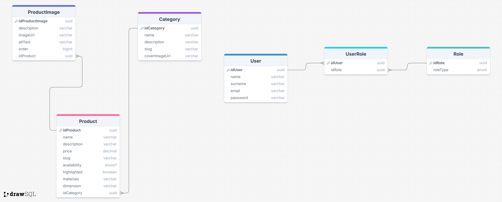
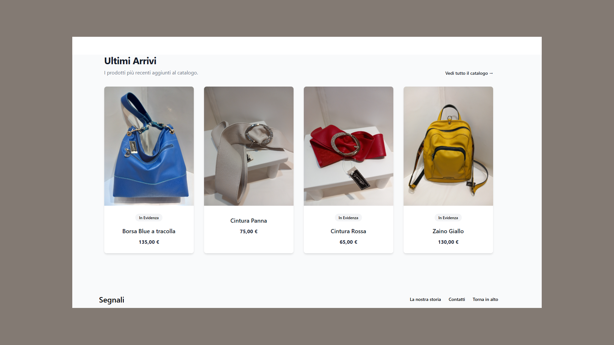
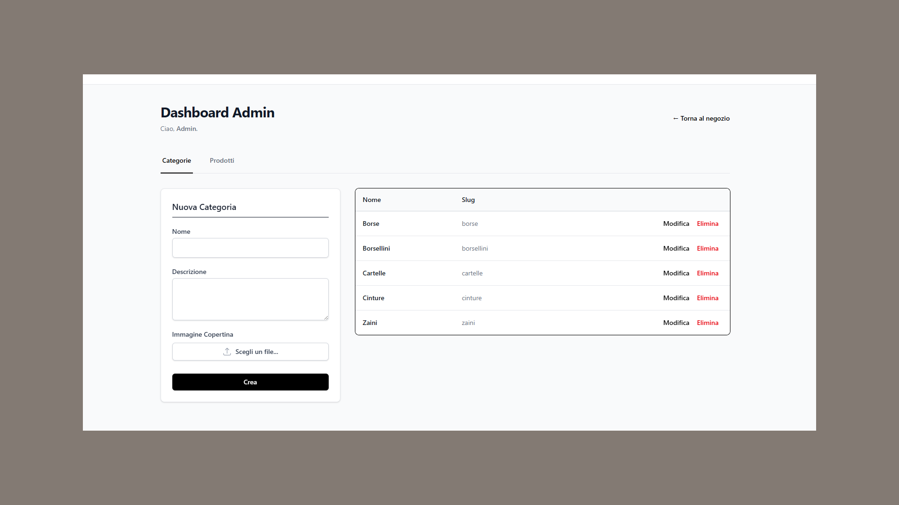
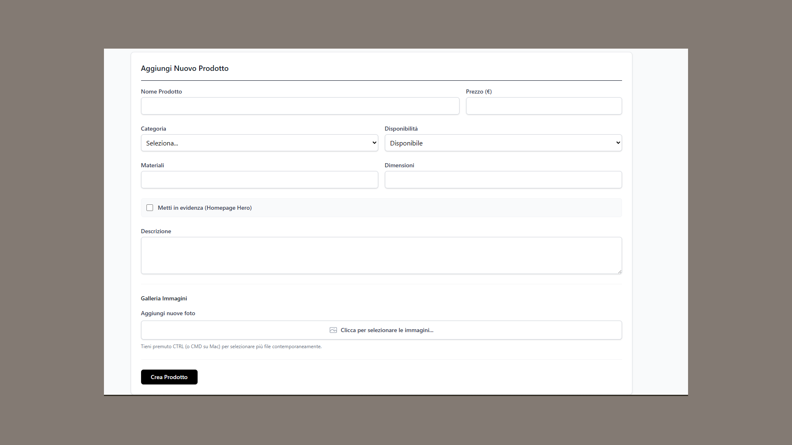

# Capstone Project - Vetrina Negozio di Artigianato

**Corso Full Stack Developer - Epicode 2025**
**Autore:** Emanuele Sanna

> **Live Demo:** [Clicca qui per visitare il sito](https://capstone-frontend-fawn.vercel.app/)

## Descrizione del Progetto

Questo progetto rappresenta il lavoro conclusivo (Capstone) del percorso di studi Full Stack. L'obiettivo è stato sviluppare un sito vetrina completo per un negozio di artigianato, diviso in due applicativi distinti (Backend API e Frontend Client).

Il sistema permette la gestione completa di un catalogo prodotti, categorie e upload di immagini, con un'area riservata protetta per l'amministrazione.

---

## Stack Tecnologico

### Backend (Server-side)

L'architettura backend è costruita secondo il pattern RESTful.

- **Java 21** & **Spring Boot 3**: Framework principale.
- **Spring Data JPA / Hibernate**: Per l'interazione con il database e ORM.
- **Spring Security + JWT**: Gestione autenticazione e autorizzazione (Ruoli ADMIN/USER).
- **PostgreSQL**: Database relazionale.
- **Cloudinary**: Servizio esterno per lo storage e l'ottimizzazione delle immagini.
- **Maven**: Gestione delle dipendenze.
- **Docker**: Containerizzazione per il deploy.

### Frontend (Client-side)

Interfaccia utente reattiva e performante.

- **React** (Vite): Libreria UI.
- **TypeScript**: Per la tipizzazione statica e robustezza del codice.
- **Tailwind CSS**: Framework CSS utility-first per lo styling.
- **React Router DOM**: Gestione della navigazione client-side.
- **Axios**: Client HTTP per le chiamate API.
- **Heroicons**: Icon set.

### Deployment & DevOps

Il progetto è online e accessibile pubblicamente grazie a una suite di servizi Cloud gratuiti:

- **Database:** Neon (PostgreSQL Serverless).
- **Backend Hosting:** Render (Container Docker).
- **Frontend Hosting:** Vercel.

---

## Funzionalità Principali

### Lato Pubblico (Store)

- Visualizzazione prodotti con paginazione.
- Filtro prodotti per categoria.
- Dettaglio singolo prodotto con galleria immagini.
- Design responsive per mobile e desktop.

### Pannello Amministratore (Dashboard)

- **Autenticazione Sicura:** Login tramite token JWT.
- **Gestione Categorie:** CRUD completo (Crea, Leggi, Aggiorna, Elimina) con upload immagine di copertina.
- **Gestione Prodotti:** CRUD completo con dettagli (prezzo, disponibilità, materiali).
- **Multi-Image Upload:** Caricamento multiplo di immagini per singolo prodotto.
- **Validazione Dati:** Gestione errori lato server con feedback visivo immediato per l'utente.

---

## Database Schema



---

## Installazione e Setup Locale

### Prerequisiti

- Java 21.
- Node.js e npm.
- PostgreSQL installato localmente (o un'istanza cloud accessibile).

### 1. Configurazione Backend

1.  Clona il repository.
2.  Apri la cartella `backend`.
3.  Crea un file chiamato `env.properties` nella root del **backend** dove conserverai le variabili d'ambiente:
    ```properties
    DB_URL=jdbc:postgresql://localhost:5432/tuo_db
    DB_USERNAME=tuo_user
    DB_PASSWORD=tua_password
    CLOUDINARY_NAME=...
    CLOUDINARY_KEY=...
    CLOUDINARY_SECRET=...
    JWT_SECRET=...
    ADMIN_EMAIL=...
    ADMIN_PASSWORD=...
    ```
4.  Il file `application.properties` userà queste variabili. Assicurati che contenga:
    ```properties
    spring.config.import=optional:file:env.properties
    spring.application.name=capstone
    server.port=3001
    # ... resto della configurazione standard
    ```
5.  Avvia l'applicazione:
    ```bash
    mvn spring-boot:run
    ```

### 2. Configurazione Frontend

1.  Clona il repository: `https://github.com/ESan9/capstone-frontend.git`
2.  Apri la cartella `frontend` nel terminale.
3.  Installa le dipendenze:
    ```bash
    npm install
    ```
4.  Crea un file `.env` nella root del frontend:
    ```env
    VITE_API_URL=http://localhost:3001/api
    ```
5.  Avvia il server di sviluppo:
    ```bash
    npm run dev
    ```

---

## Anteprima (Screenshots)

### Lato Pubblico

|       Home Page - Top       |       Home Page - List       |
| :-------------------------: | :--------------------------: |
|  |  |

### Pannello Amministratore

|           Dashboard           |           Gestione            |
| :---------------------------: | :---------------------------: |
|  |  |

---

## Contatti

**Emanuele Sanna**

- [LinkedIn](https://www.linkedin.com/in/emanuelesanna/)
- [GitHub](https://github.com/ESan9)

---

_Progetto realizzato per il corso Epicode 2025._
